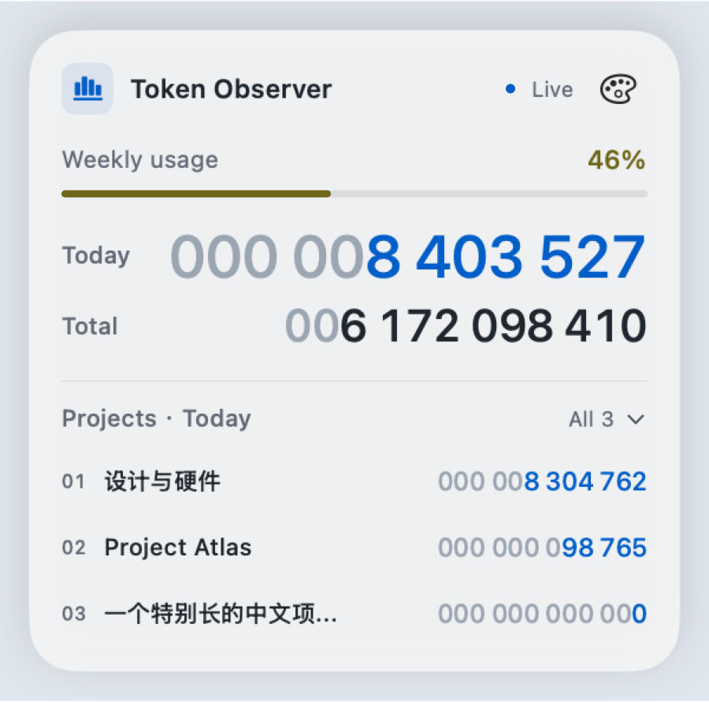
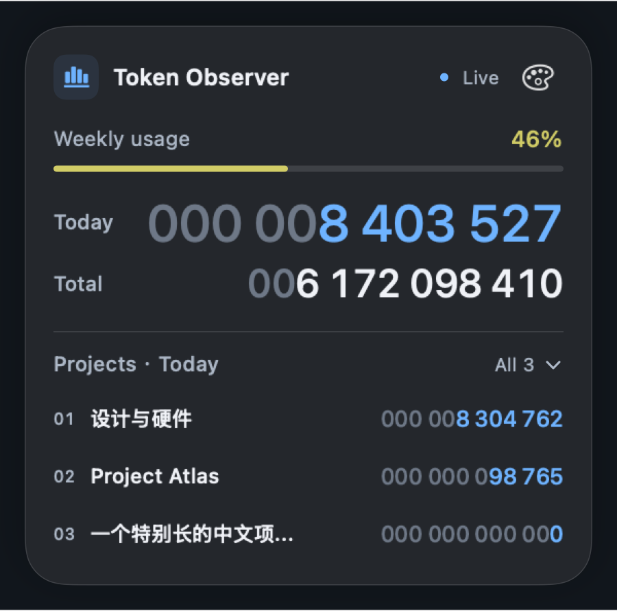
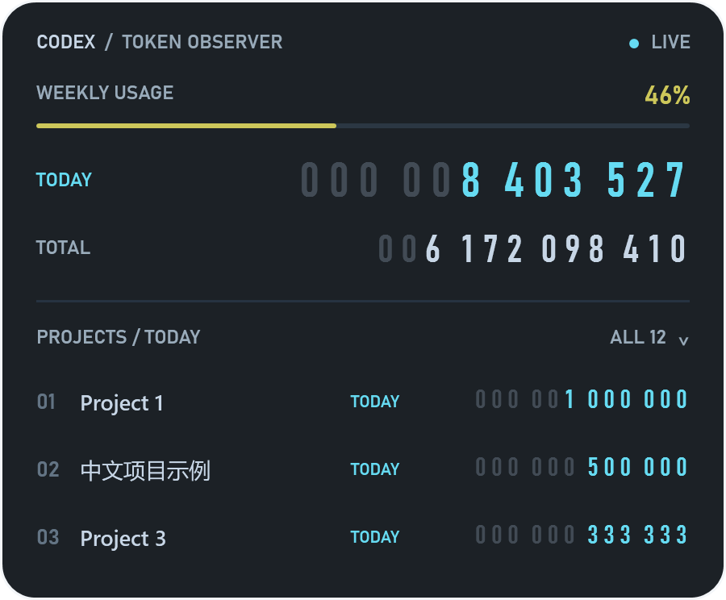
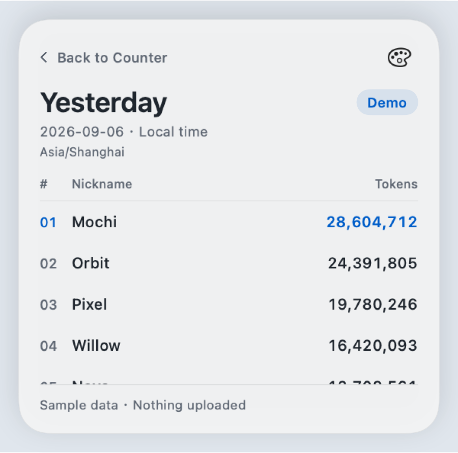
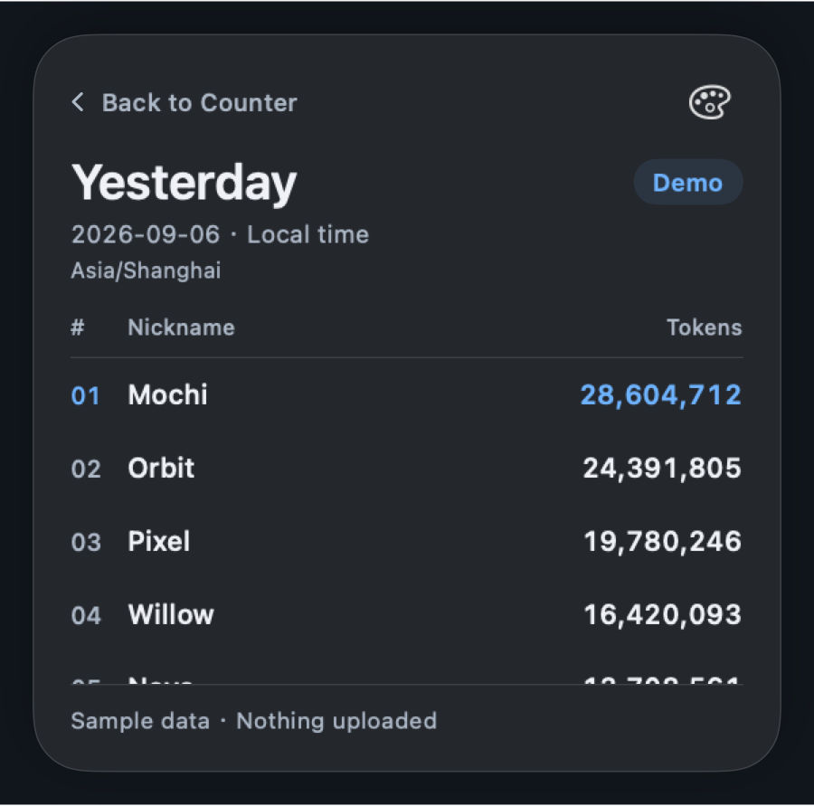

# Zuno

Zuno 原名 Codex Token Observer。当前 **0.3.0 正在进行联网版发布验证，尚未正式发布**：应用使用小庄的缅因猫坐姿图标，名称为 `Zuno`，新增首次永久昵称创建、联网昨日榜和每周剩余额度，保留全部本地统计功能及 Mac Mist / Classic 外观切换。下方 GitHub 下载链接仍指向已发布的 **Codex Token Observer v0.2.1**，并非 Zuno 开发版。

Windows 源码已同步 Zuno 品牌与联网功能；Mac、Windows 将在运行验证及共享榜单服务开放后一起发布。公开双平台下载仍为 v0.2.1。

本地优先的 macOS / Windows Codex Token 桌面观察器，显示 `TODAY`、`TOTAL` 和今日消耗最多的三个项目，使用机械里程表式数字动画。项目显示名优先匹配 Codex 侧栏名称，不再只取磁盘文件夹名。界面、菜单、提示和可访问标签统一使用英文，项目名称保留原文（包括中文），不翻译。

已发布 v0.2.1 的 Mac Mist 深浅色界面（历史版本截图，使用模拟数据，不含个人使用记录）：

 

已发布 v0.2.1 的 Windows 界面：



## 系统要求

- Mac：Apple Silicon，macOS 14+，且 `/usr/bin/python3` 必须可运行；当前 Mac 包未内嵌 Python。
- Windows：Windows 11 x64，已内嵌 Python 和 .NET，无需另装运行环境。
- 两端都需要本机 Codex 会话记录；Windows 不自动读取 WSL 或另一台电脑的记录。
- 这是桌面应用，不是 iOS/iPadOS 应用。暂无 Intel Mac、Windows ARM 原生包。

应用不需要 OpenAI API Key。聊天内容、项目名称及 OpenAI 凭据不会上传；首次点击 `Create & Join` 创建昵称后，随机安装 ID、昵称及加入后的真实 Token 日总量会自动公开到榜单，可暂停同步。详见 [`PRIVACY.md`](PRIVACY.md)。

## V1 数据口径

- `TODAY`：本机当地时间当天 00:00 起、且不早于首次初始化时间的 Codex Token 活动量。
- `TOTAL`：本机从首次初始化开始累计的 Codex Token 活动量。
- `PROJECTS / TODAY`：按任务工作目录合并项目，按 `TODAY`（今日）消耗降序排列；今日量相同时按 `TOTAL`（累计）降序，再按名称和完整路径稳定排序。收起时只显示前三名的今日量；展开时，前三名显示今日量与累计量，其余项目只显示累计量，整个列表仍按今日排名排列。项目今日量与全局今日量均按本地日期统计，在跨午夜后的下一次采样更新为新一天的数值。
- 顶部 `Weekly remaining` / `WEEKLY REMAINING`（每周剩余额度）：显示已登录账号的 Codex 主每周额度剩余比例，计算为 `100% − 当前窗口已用比例`，范围为 0–100%。重置后在下一次成功采样时跟随账号余额恢复，不叠加重置前用量；余额多时为绿色长条，随消耗缩短并逐渐变黄、变红。这是账号额度比例，不是固定 Token 数；`TODAY` 和 `TOTAL` 的历史消耗不会因此清零。
- 数据来自本机 `~/.codex/sessions/**/*.jsonl` 中 Codex 写入的 `token_count` 事件。
- 每条事件只计一次；程序停止期间产生的新事件会在下次启动时补记。
- 不追回首次初始化以前的历史 Token。

这里的 Token 是 Codex 报告的活动量，不等同于费用、剩余额度或 API 账单。

## 运行

计数后台只依赖 Python 标准库，从源码安装建议 Python 3.11+。

```bash
python3 -m codex_token_counter.cli init
python3 -m codex_token_counter.cli status
python3 -m codex_token_counter.cli watch
```

从仓库根目录运行时，需要把 `src` 加入模块路径：

```bash
PYTHONPATH=src python3 -m codex_token_counter.cli init
PYTHONPATH=src python3 -m codex_token_counter.cli watch
```

本机已经初始化过后，可以随时查看当前累计值：

```bash
PYTHONPATH=src python3 -m codex_token_counter.cli status
```

默认数据库位于项目内的 `data/token_counter.sqlite3`。可以使用 `--db` 指定其他位置。

## macOS 桌面浮窗

构建并打开原生桌面观察器：

```bash
chmod +x desktop-observer/build-app.sh
desktop-observer/build-app.sh
open "dist/Zuno.app"
```

应用默认位于桌面右下角，Token 更新时数字会滚动变化。数字带有弱化的前导零，超出预留位数后自动扩展并适配宽度。当前每周剩余额度耗尽时，有效数字改为红色；重置后根据最新余额恢复，不受旧累计用量影响。项目名过长会换行或省略，悬停可查看完整项目名和目录。

Mac v0.2.1 新增右上角调色盘按钮 `Appearance`。可选择 `Mist`：原生雾面、系统字体、蓝色今日数字并跟随系统深浅色；或 `Classic`：原有深色仪表、青色今日数字和银灰累计数字。没有保存过外观选择时默认 `Mist`，选择独立保存，下次启动保留；切换不会改变统计、项目展开或手动隐藏状态。右键和菜单栏菜单也提供 `Appearance`。已有背景、跟随和演示基数偏好保持不变；`Show Translucent Background` 仍可关闭底板。Windows v0.2.1 保留现有 WPF 界面，不包含 Mac 的外观切换。

项目名随每次采样从 Codex 本地项目元数据只读更新；在 Codex 中改名后，下一次采样即可同步。
目录是统计身份，侧栏项目名是显示标签，聊天任务标题不是项目名；无法匹配时仍显示目录名。
此更新不改写历史 Token，也不将不同目录因显示同名而合并。

点击 `PROJECTS / TODAY` 或右侧 `ALL N` 展开所有已统计项目，列表可滚动；展开后右侧显示 `COLLAPSE · N`，再点同一栏收起（Mist 中为 `Projects · Today` / `All N` / `Collapse`）。收起时前三名只显示今日值，展开后为前三名补充累计值，其余项目只显示累计值。展开和收起都保留今日排名；展开时保持窗口在屏幕内，默认向上延展，收起后恢复紧凑尺寸。

每周额度通过本机 Codex CLI / ChatGPT.app 内置 CLI 的官方只读接口取得，使用已有登录状态。它不会执行额度重置。悬停额度条可查看当前剩余、已用比例及到期时间；接口暂时不可用时，旧余额标为 `STALE`，没有可用值时显示 `—`，不会把未知余额当成 100%。桌面观察器启动时采样一次，此后每 300 秒（5 分钟）扫描并更新统计，包括重置后的余额。数值变化时以约 3–5 秒的先快后慢动画滚动到新值，随后静止等待下一次采样；数值不变时不重播动画。

菜单中的 `Follow Codex / ChatGPT` 默认开启：Codex 或 ChatGPT 原生应用在前台时，浮窗置顶；切换到其他应用时，浮窗退回普通窗口层级，让其他窗口覆盖它。关闭该选项可恢复常驻置顶。此设置只控制窗口层级，不会增加 ChatGPT 会话的 Token 统计。

窗口可以直接拖动并吸附边缘；右键选择 `Hide Window` 后，后台仍按采样间隔继续统计，切换到 Codex 或 ChatGPT 也不会自动取消手动隐藏。顶部菜单栏图标可通过 `Show Window` 重新显示浮窗，也可切换角落、开关半透明底板、调整跟随设置或退出应用。浮窗会自动启动统计后台，不需要额外打开终端。

本地 Zuno 0.3.0 开发版（尚未发布）：Mac 应用现在显示在 Dock 和 Command-Tab 中，并带有小庄的独立猫咪图标。点击 Dock 图标可找回浮窗；右键 Dock 图标也提供 `Show Window` / `Hide Window`。应用隐藏时仍继续统计，只有 `Quit` 才会停止。建议将构建后的 `Zuno.app` 放入“应用程序”目录；需要退出后也保留 Dock 入口时，右键图标选择“选项 → 在程序坞中保留”。

改名不会初始化新账本：应用的运行数据库继续位于 `~/Library/Application Support/Codex Token Observer/token_counter.sqlite3`，Bundle ID 仍为 `design.codex.token-observer`，已有累计量、今日量及外观等偏好沿用。内部可执行文件仍叫 `CodexTokenObserver`，无需手动迁移或改名数据目录。构建只生成 / 更新 `dist/Zuno.app`，不会删除旧 `dist/Codex Token Observer.app`；使用新版前应先退出旧版，避免两份应用同时采样。

开发时可渲染同一套 SwiftUI 界面，用于检查排版；预览使用示例数据，不读写运行账本：

```bash
cd desktop-observer
swift build
.build/debug/CodexTokenObserver --preview-output /tmp/token-observer-preview
```

## 永久昵称与联网昨日榜（0.3.0，发布验证中）

在标题或非交互空白区域双击，可在 Counter 与 Yesterday 榜单之间切换；右键菜单和菜单栏／托盘也提供 `Leaderboard` / `Back to Counter`，榜单左上角有返回按钮。按钮、项目列表和榜单滚动区不响应切页双击，拖动窗口仍保留。两页共用同一个浮窗，切页不改变位置、尺寸或项目展开状态，后台计数继续工作；启动默认显示 Counter，不主动切页、弹窗或提醒查看。

首次启动显示取名窗口；输入 2–24 个字符（中英文字母、数字、空格、下划线或连字符），点击 `Create & Join`，即确认名字不可修改并开始自动分享。名字由服务端校验唯一性，绑定随机安装 ID；重启和升级保留，一台电脑的一次安装是一位参赛设备，不是真人账号。注册结果不确定时只能重试原名，不能靠重试改名。可关闭窗口继续本地计数，稍后通过 `Your Zuno profile` 创建。

排行榜统一按 `Asia/Shanghai` 昨日统计，只接收加入后的真实活动，排除模拟事件和视觉演示基数。每 5 分钟自动同步，断网后补报近 7 天；重复同步使用绝对值去重，不会把同一次消耗重复相加。全体已上报设备可通过翻页查看，另显示自己的位置；昨日未上报时显示未入榜，不用虚构人物填充。新建角色的活动最早在次日的昨日榜出现，晚到的上报可更新排名。

`Your Zuno profile` 可查看固定昵称，`Pause leaderboard sync` / `Resume leaderboard sync` 暂停或恢复同一身份。暂停不会删除已公开记录或允许改名。网络失败不影响本地 Today/Total，界面区分旧榜单、未连接及上传待完成；这是设备自行上报的趣味榜，不是 OpenAI 验证榜，也不承诺绝对防刷。服务地址为 `https://zuno-leaderboard.nightmareop.chatgpt.site`；公开开放前不发布正式联网安装包。

下方是此前设计阶段的虚构数据截图，不代表线上参与者或当前结果；运行时不再回退到演示榜。

 

## 给朋友安装

从 [Codex Token Observer v0.2.1 双平台预览版下载页](https://github.com/nightmareop-Kai/codex-token-observer/releases/tag/v0.2.1) 下载对应平台的 ZIP，不要选自动生成的 Source code。此处仍是改名前的公开版本；Zuno 0.3.0 尚未发布。Windows 仍为 Preview，欢迎同事试用反馈。

- Mac：解压，将 `.app` 拖入“应用程序”后打开。升级前退出旧版再替换应用。
- Windows：完整解压，保留全部文件，双击 `CodexTokenObserver.exe`。不要仅复制 exe 或在 ZIP 中直接打开。升级前退出旧版，使用新解压的文件夹。
- Mac 菜单栏或 Windows 系统托盘中的 `Show Window` 可以恢复浮窗，`Hide Window` 不会停止采集。

升级不删除账本：Mac 保存在上述 Application Support 目录；Windows 保存在 `%LOCALAPPDATA%\Codex Token Observer\token_counter.sqlite3`。

Mac 包为 ad-hoc 签名、未经过 Apple 公证；Windows 包未做商业代码签名。系统可能提示无法验证开发者，请核对下载地址和 SHA256，遵循公司 IT 安装策略，不要关闭系统安全保护。

`WEEKLY REMAINING` 需要已有登录状态的官方 Codex CLI。Windows 若 PATH 中没有可用原生 `codex.exe`，可设置用户环境变量 `CODEX_TOKEN_OBSERVER_CODEX_BIN` 指向已有官方 `codex.exe` 后重开。额度不可用显示 `—` 或 `STALE`，不影响本地 Token 计数；软件不会执行登录、AI 任务或额度重置。

Windows 首版采用原生 WPF 字体，外观不保证与 Mac 逐像素一致；默认只显示真实 Token。Mac 的可选视觉测试基数不计入真实账本。

## 生成分享包

```bash
chmod +x desktop-observer/package-release.sh
desktop-observer/package-release.sh 0.3.0
```

当前 Mac 源码会生成 `release/Zuno-0.3.0-macos-arm64.zip` 及 `.sha256`，ZIP 内为 `Zuno.app`。此命令仅生成本地分享包，不会上传 GitHub；公开发布前仍须完成 [`RELEASE.md`](RELEASE.md) 中的核验。

Windows 在装有 .NET 10 SDK 的 Windows 开发环境中执行 `./windows-observer/build-release.ps1`。
当前 Windows 源码预期生成 `Zuno-0.3.0-windows-x64.zip`，内部目录名为 `Zuno`，可执行文件仍为 `CodexTokenObserver.exe`。这是构建目标，不代表本轮已生成或验证 Windows 安装包；发布前必须在 Windows 上完成编译及解包运行测试。
脚本生成 ZIP 和 SHA256，同版本已有包不会覆盖。GitHub Actions 会从解压后的 Windows 包运行 UI / 计数 smoke tests。
构建不会打包本机账本、会话、账号凭据或项目 Python 缓存，验证截图只使用隔离测试数据。

## 当前边界

这个原型通过读取 Codex 本地会话日志验证统计逻辑。正式产品阶段需要评估更稳定的 App Server 事件接入；目前 App Server 协议已经确认存在 `thread/tokenUsage/updated`，但独立进程不能直接假定能够订阅桌面应用已经运行的线程。

详细口径见 [`docs/v1-data-contract.md`](docs/v1-data-contract.md)。

## 许可证

本项目采用 [MIT License](LICENSE)。
